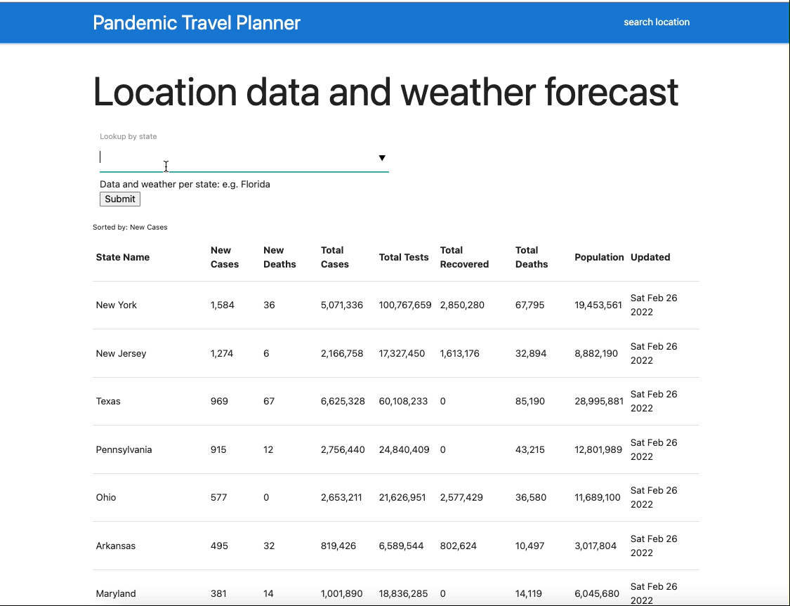

# Pandemic Travel Planner 

State name searches, reveals coronavirus statistics and the weather forecast information. 

## Project Philosophy

This webapp was made with the intentions of equipping domestic travelers in the United States with essential data. Making their destination selection and planning during the pandemic, an informed one. 

[Github Url](https://github.com/krogersdev/pandemic-travel-planner.git)


## Features

- Responsive web design.

- Autocomplete tab for faster searches.

- Searching a single state retreives coronavirus data and the weather forecast.

- Data updated through previous day.

## Demo

### Navigation


### Searching


## Location stats and Weather



## Mobile version


## Built with

- Vanilla JavaScript 
- HTML
- Materialize (front-end framework)


## API Reference

#### Covid-19 Api

```http
 https://disease.sh/
```

#### Weather Api 
required: API key 

```http
  https://www.weatherapi.com
  
```


### Acknowledgements

 - [Awesome Readme Templates](https://awesomeopensource.com/project/elangosundar/awesome-README-templates)
 - [Powered by WeatherAPI.com](https://www.weatherapi.com/docs/)
 - [Image reference](https://www.13newsnow.com/article/news/health/coronavirus/cdc-avoid-travel-puerto-rico-guam-switzerland/507-7a51f2fd-0bff-4ac0-913c-3837a83cb56d)
 


